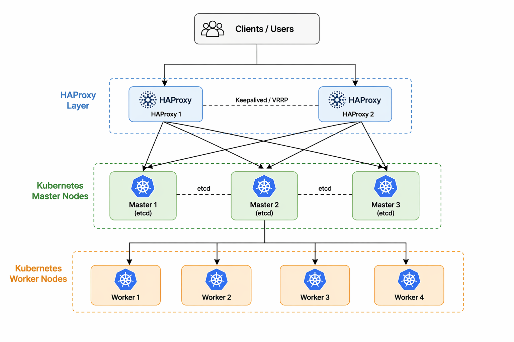
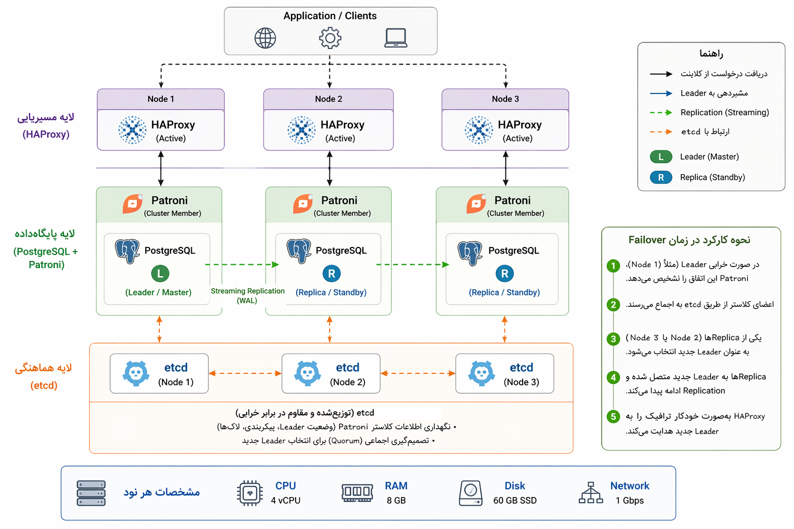

# معماری و تحلیل منابع زیرساخت Kubernetes

«در پی سناریوی مطرح‌شده برای راه‌اندازی کلاستر کوبرنتیس و استقرار سرویس‌های مورد نیاز، مجموعه‌ای از نیازمندی‌ها شناسایی گردید که در ادامه به‌صورت مشروح به بررسی آن‌ها پرداخته خواهد شد.»

معماری و منابع در نظر گرفته‌شده با هدف دستیابی به **تحمل خطا (Fault Tolerance)** طراحی شده‌اند، به‌گونه‌ای که از کار افتادن یک یا چند ماشین منجر به توقف کل سیستم نشود. همچنین با توجه به میزبانی سه محیط dev، stage و production در این زیرساخت، منابع در سطحی متعادل و متناسب با این سناریو تخصیص داده شده‌اند.

---

# بخش اول: زیرساخت کلاستر Kubernetes




## Control Plane (Master Nodes)

برای دستیابی به High Availability، تعداد ۳ نود مستر در نظر گرفته شده است. در این معماری، حتی در صورت از دسترس خارج شدن یکی از نودها، کلاستر بدون وقفه به فعالیت خود ادامه می‌دهد. این پایداری به‌واسطه مکانیزم‌های Self-healing کوبرنتیس و همچنین ساختار توزیع‌شده دیتابیس etcd تضمین می‌شود.

به‌طور کلی، در صورت استفاده از ۳ نود مستر، حد نصاب (Quorum) برابر با ۲ خواهد بود. این یعنی کلاستر می‌تواند از دست رفتن یک نود را تحمل کرده و بدون اختلال به فعالیت خود ادامه دهد.

**مزیت:** امکان خارج کردن یکی از نودها برای به‌روزرسانی یا تعمیر بدون ایجاد اختلال در سرویس‌دهی.

در مقابل، در صورت استفاده از تنها یک نود مستر:
- با از دست رفتن آن، کل کلاستر از دسترس خارج می‌شود  
- اپلیکیشن‌ها فقط تا زمان کرش شدن به کار ادامه می‌دهند  
- هیچ عملیات مدیریتی (kubectl) قابل انجام نخواهد بود  
- مکانیزم Self-healing عملاً از کار می‌افتد  

---

با توجه به وابستگی بالای API Server و Scheduler به CPU، حداقل 4 Core برای هر مستر در نظر گرفته شده است تا در شرایط افزایش درخواست‌ها (مانند Auto Scaling) عملکرد پایدار حفظ شود.

همچنین etcd به‌شدت وابسته به RAM است و مستقیماً روی latency تأثیر می‌گذارد، بنابراین 8 گیگابایت RAM برای هر مستر به‌عنوان مقدار مناسب برای بار کاری متوسط در نظر گرفته شده است.

---

## API Server Load Balancing (HAProxy)

به‌منظور تضمین دسترسی پایدار به API Server، از دو نود Load Balancer مبتنی بر HAProxy به همراه Floating VIP استفاده شده است. این لایه وظیفه توزیع بار بین مسترها را بر عهده دارد.

در این معماری:
- Health Check روی پورت 6443 انجام می‌شود  
- در صورت از کار افتادن یک مستر، ترافیک به سایر نودها منتقل می‌شود  
- امکان افزایش تعداد مسترها (مثلاً به ۵ نود) بدون تغییر در ساختار اصلی فراهم است  

این طراحی باعث افزایش پایداری و حذف Single Point of Failure در لایه Control Plane می‌شود.

---

## Worker Nodes

در این سناریو، ۴ نود Worker در نظر گرفته شده است. این انتخاب صرفاً برای افزایش تعداد ماشین‌ها نیست، بلکه برای **توزیع واقعی workloadها و جلوگیری از تداخل منابع** انجام شده است.

هر Worker دارای:
- 16 Core CPU  
- 24 GB RAM  

می‌باشد که این مقدار یک تعادل منطقی بین «قابلیت اجرا» و «پایداری حداقلی» محسوب می‌شود.

---

### طراحی ذخیره‌سازی در Workerها

- دیسک ۸۰ گیگابایتی: سیستم‌عامل + ایمیج‌های Kubernetes  
- دیسک ۵۰ گیگابایتی: داده‌های MinIO (Distributed Storage)  
- دیسک ۴۰ گیگابایتی: داده‌های RabbitMQ  

همچنین:
- یک دیسک ۴۰ گیگابایتی روی یکی از Workerها برای Prometheus در نظر گرفته شده است (HostPath)  
- در صورت نیاز به مقیاس‌پذیری بیشتر، امکان استفاده از Storage Server مجزا و NFS وجود دارد  

---

### مزیت استفاده از ۴ Worker

این طراحی باعث می‌شود:
- workloadها از هم ایزوله شوند  
- فشار I/O سرویس‌هایی مثل MinIO روی سرویس‌های حساس مثل Prometheus اثر نگذارد  
- spikeهای GitLab Runner باعث اختلال در سرویس‌های حیاتی نشود  
- در صورت از دست رفتن یک نود، Kubernetes پادها را روی سایر نودها بازتوزیع کند  

---

# بخش دوم: سرویس‌های مستقر روی Kubernetes

## لیست سرویس‌ها

سرویس‌های زیر به‌صورت هم‌زمان روی این کلاستر اجرا می‌شوند:

- Argo CD  
- HashiCorp Vault  
- Keycloak  
- RabbitMQ  
- MinIO  
- Prometheus  
- Grafana  
- Loki  
- GitLab Runner  

---

## تحلیل مصرف منابع سرویس‌ها

ماهیت مصرف منابع در این سرویس‌ها متفاوت است:

- **Prometheus**  
  مصرف RAM بالا به دلیل نگهداری داده‌های time-series  
  در صورت کمبود منابع → crash یا از دست رفتن داده  

- **MinIO و Loki**  
  وابسته به I/O و CPU  
  دارای حجم بالای عملیات خواندن/نوشتن  

- **Keycloak (Java-based)**  
  حساس به CPU و RAM  
  کمبود منابع → افزایش latency در احراز هویت  

- **RabbitMQ**  
  مصرف بالای RAM در زمان افزایش queue  
  ریسک از دست رفتن پیام در صورت فشار بالا  

- **GitLab Runner**  
  مصرف غیرقابل پیش‌بینی  
  ایجاد spikeهای شدید در CPU و RAM  

---

## لاگینگ (Loki)

در بخش لاگینگ با استفاده از Loki، لاگ‌ها به‌صورت استاندارد روی Object Storage (S3) ذخیره می‌شوند و برای بهینه‌سازی مدیریت داده‌ها، سیاست‌های Retention مشخص (مانند 7، 14 یا 30 روز) اعمال خواهد شد و در صورت وجود چند تیم یا پروژه، قابلیت Multi-Tenancy فعال می‌شود تا جداسازی لاگ‌ها به شکل منطقی انجام گیرد
در لایه ذخیره‌سازی نیز با فعال‌سازی Compression (مانند snappy یا zstd) و تنظیم Chunk Size مناسب، هم هزینه ذخیره‌سازی روی S3 کاهش می‌یابد و هم سرعت query افزایش پیدا می‌کند، در نهایت نیز با اتصال Loki به Grafana امکان تعریف Alert بر اساس الگوهای مشخص مانند افزایش خطاها یا Crash شدن سرویس‌ها فراهم می‌شود تا مانیتورینگ لاگ‌ها به‌صورت هوشمند و واکنشی انجام شود.

در این معماری:
- لاگ‌ها روی Object Storage (S3) ذخیره می‌شوند  
- Retention Policy (۷ / ۱۴ / ۳۰ روز) تعریف می‌شود  
- Multi-Tenancy برای جداسازی لاگ‌ها فعال می‌شود  

برای بهینه‌سازی:
- Compression (snappy / zstd) فعال می‌شود  
- Chunk Size تنظیم می‌شود برای بهبود Query Performance  

همچنین با اتصال به Grafana:
- امکان تعریف Alert بر اساس لاگ‌ها فراهم می‌شود  

---

## GitLab Runner و CI/CD

GitLab Runner به داخل کلاستر منتقل شده است تا:
- تخصیص منابع به‌صورت داینامیک انجام شود  
- از هدررفت منابع جلوگیری شود  
- امنیت اجرای Jobها افزایش یابد  

همچنین:
- کش CI روی S3 ذخیره می‌شود  
- زمان Build در اجرای‌های بعدی کاهش می‌یابد  

---

## امنیت Build با Kaniko

برای Build ایمیج‌ها از Kaniko استفاده شده است.

مزایا:
- عدم نیاز به Docker daemon  
- عدم نیاز به privileged container  
- افزایش امنیت در CI/CD  

نحوه عملکرد:
- دریافت Dockerfile و سورس پروژه  
- Build لایه‌ها به‌صورت فایل‌سیستمی  
- Push مستقیم به Registry  

## Container Image Security (Trivy)

در راستای افزایش امنیت زنجیره تأمین (Supply Chain Security)، از ابزار **Trivy** برای اسکن ایمیج‌های کانتینری استفاده خواهد شد.

Trivy وظیفه بررسی Imageها را از نظر موارد زیر بر عهده دارد:
- آسیب‌پذیری‌های امنیتی (CVEs)
- پکیج‌های دارای ریسک امنیتی
- مشکلات مربوط به Base Image
- Misconfiguration در لایه‌های مختلف image

این اسکن در مرحله CI/CD و قبل از Push شدن image به Registry انجام می‌شود تا از ورود imageهای ناامن به محیط‌های dev، stage و production جلوگیری شود. این رویکرد باعث افزایش امنیت کلی کلاستر و کاهش سطح حمله (Attack Surface) خواهد شد.

---

## GitOps و Argo CD

در این معماری، به منظور استانداردسازی فرآیند استقرار و افزایش قابلیت کنترل تغییرات، رویکرد **GitOps** به عنوان مدل اصلی مدیریت Deployments در نظر گرفته شده است.

در مدل GitOps، Git به عنوان **Single Source of Truth** عمل می‌کند؛ به این معنا که:
- وضعیت مطلوب (Desired State) تمام سرویس‌ها در Git تعریف و نگهداری می‌شود
- هر تغییر در زیرساخت یا اپلیکیشن تنها از طریق Commit / Merge Request اعمال می‌شود
- استقرارها به صورت خودکار و مبتنی بر تغییرات Git انجام می‌گیرند
- وضعیت واقعی کلاستر به صورت مداوم با وضعیت تعریف‌شده در Git همگام‌سازی می‌شود

این رویکرد باعث حذف تغییرات دستی در محیط production و افزایش شفافیت و قابلیت ردیابی (Traceability) در کل چرخه تغییرات می‌شود.

---

## Argo CD (GitOps Controller)

برای پیاده‌سازی عملی مدل GitOps در این معماری، از **Argo CD** به عنوان ابزار اصلی Continuous Delivery استفاده خواهد شد.

Argo CD وظایف زیر را بر عهده دارد:
- مانیتور کردن مخازن Git و تشخیص تغییرات
- اعمال خودکار تغییرات روی کلاستر Kubernetes
- همگام‌سازی (Sync) وضعیت Git با وضعیت واقعی کلاستر
- ارائه UI و API برای مشاهده وضعیت Deployments
- مدیریت Rollback در صورت بروز خطا در استقرار

---

## مزایای استفاده از Argo CD در این معماری

استفاده از Argo CD در کنار GitOps مزایای مهمی ایجاد می‌کند:

- حذف کامل وابستگی به Deploy دستی
- افزایش پایداری در تغییرات زیرساخت و اپلیکیشن
- امکان Rollback سریع به نسخه‌های قبلی
- مشاهده دقیق وضعیت هر سرویس در کلاستر
- کاهش خطای انسانی در فرآیند استقرار

---

## جایگاه GitLab در کنار Argo CD

در این معماری:
- **GitLab** نقش مدیریت کد، CI و نسخه‌بندی را بر عهده دارد
- **Argo CD** نقش اجرای استقرارها (CD) را به صورت GitOps محور انجام می‌دهد

به این ترتیب:
- GitLab → مدیریت تغییرات و Build
- Argo CD → اعمال تغییرات روی Kubernetes

---

## Container Registry (Harbor)

برای مدیریت و نگهداری Imageهای کانتینری، از **Harbor** به عنوان Private Container Registry استفاده خواهد شد.

Harbor قابلیت‌های زیر را فراهم می‌کند:
- ذخیره‌سازی امن Imageها در محیط داخلی
- Role-Based Access Control (RBAC)
- Vulnerability Scanning (یکپارچه با Trivy)
- پشتیبانی از Image Signing
- مدیریت پروژه‌ها و Namespaceهای مختلف


---

# بخش سوم: Resource Management و Capacity Planning

## Resource Requests & Limits

برای جلوگیری از Resource Starvation و ایجاد پایداری در کلاستر، برای تمامی سرویس‌ها مقدار request و limit تعریف خواهد شد.

- **Request:** حداقل منابع تضمین‌شده برای هر Pod  
- **Limit:** حداکثر منابع قابل استفاده  

این کار باعث می‌شود:
- Scheduler تصمیم‌گیری دقیق‌تری انجام دهد  
- از Overcommit بیش از حد جلوگیری شود  
- پایداری سرویس‌های حیاتی حفظ شود  

---

## Resource Quota

با توجه به میزبانی سه محیط مجزا (dev، stage و production) در یک کلاستر Kubernetes و استفاده از Namespaceهای جداگانه، برای جلوگیری از مصرف بی‌رویه منابع و ایجاد تداخل بین محیط‌ها، از مکانیزم ResourceQuota استفاده می‌شود.

هدف از این کار:
- جلوگیری از مصرف بیش از حد منابع توسط یک محیط  
- تضمین پایداری محیط production  
- ایجاد عدالت در تخصیص منابع بین تیم‌ها و محیط‌ها  

```yaml
apiVersion: v1
kind: ResourceQuota
metadata:
  name: prod-quota
  namespace: prod
spec:
  hard:
    requests.cpu: "32"
    requests.memory: "64Gi"
    limits.cpu: "48"
    limits.memory: "96Gi"
    pods: "100"
```
---

## Node Affinity و Workload Isolation

برای جلوگیری از تداخل workloadها، از مکانیزم‌های زیر استفاده می‌شود:

- **Node Affinity:** تخصیص سرویس‌ها به نودهای مشخص  
- **Taints & Tolerations:** جلوگیری از اجرای ناخواسته پادها روی نودهای خاص  

مثال:
- اجرای MinIO روی نودهای با دیسک قوی  
- اجرای Prometheus روی نود با RAM پایدار  
- ایزوله کردن GitLab Runner برای جلوگیری از ایجاد اختلال  

---

## Horizontal & Vertical Scaling

برای مدیریت رشد بار کاری:

- **Horizontal Pod Autoscaler (HPA):** افزایش/کاهش تعداد پادها بر اساس CPU/RAM  
- **Vertical Pod Autoscaler (VPA):** تنظیم خودکار منابع هر پاد  

این مکانیزم‌ها باعث می‌شوند:
- مصرف منابع بهینه شود  
- سیستم در برابر تغییرات بار مقاوم باشد  

---
# معماری و تحلیل منابع زیرساخت DATABASE

پایگاه‌داده PostgreSQL به‌صورت پیش‌فرض مکانیزم High Availability (HA) ارائه نمی‌دهد؛ به این معنا که در صورت از کار افتادن سرور اصلی، سرویس دیتابیس به‌طور کامل متوقف خواهد شد. به‌منظور رفع این محدودیت، از ابزار Patroni استفاده می‌شود تا یک لایه HA روی PostgreSQL ایجاد گردد.

Patroni با فراهم‌سازی قابلیت Failover خودکار، در صورت بروز اختلال در نود اصلی (Leader)، به‌صورت هوشمند یکی از نودهای Replica را در عرض چند ثانیه به‌عنوان Leader جدید انتخاب کرده و بدون نیاز به مداخله انسانی، سرویس را در دسترس نگه می‌دارد. این موضوع نقش مهمی در تضمین پایداری (High Availability) و تداوم سرویس‌دهی ایفا می‌کند.

در این سناریو، سه ماشین در قالب یک کلاستر PostgreSQL پیاده‌سازی می‌شوند که در هر لحظه، یک نود به‌عنوان Leader فعال بوده و دو نود دیگر به‌عنوان Replica عمل می‌کنند. این Replicaها از طریق مکانیزم Streaming Replication داده‌ها را به‌صورت بلادرنگ دریافت می‌کنند، بنابراین در صورت از دسترس خارج شدن نود اصلی، یکی از Replicaها به‌سرعت جایگزین شده و سرویس با حداقل اختلال به کار خود ادامه می‌دهد.

اختصاص ۴ هسته CPU به هر ماشین با هدف پاسخ‌گویی به نیازهای پردازشی PostgreSQL انجام شده است؛ چراکه این دیتابیس برای اجرای هم‌زمان کوئری‌ها، مدیریت connectionها و پردازش WAL و عملیات replication به توان پردازشی مناسبی نیاز دارد. در شرایطی مانند افزایش بار یا وقوع Failover، کمبود منابع CPU می‌تواند منجر به افزایش latency یا کاهش پایداری سیستم شود، بنابراین این مقدار به‌عنوان یک حداقل منطقی برای workloadهای متوسط در نظر گرفته شده است.

همچنین تخصیص ۸ گیگابایت حافظه RAM به هر نود، به‌منظور بهبود عملکرد سیستم caching در PostgreSQL صورت گرفته است. بخش قابل‌توجهی از کارایی این دیتابیس وابسته به نگهداری داده‌های پرتکرار در حافظه (مانند shared_buffers و page cache سیستم‌عامل) است و در صورت کمبود حافظه، وابستگی به دیسک افزایش یافته و افت شدید performance رخ خواهد داد. بنابراین این میزان حافظه برای نگهداری داده‌های داغ (Hot Data) و کاهش عملیات I/O دیسک در نظر گرفته شده است.

در بخش ذخیره‌سازی، برای هر نود یک دیسک ۶۰ گیگابایتی در نظر گرفته شده است که برای نگهداری داده‌های اصلی، فایل‌های WAL و لاگ‌ها مورد استفاده قرار می‌گیرد. با توجه به اینکه در معماری replication، کل داده‌ها روی تمامی Replicaها نیز نگهداری می‌شود، هر نود باید ظرفیت کامل دیتابیس را داشته باشد. این میزان فضا به‌عنوان یک baseline برای دیتابیس‌های با حجم متوسط انتخاب شده است، هرچند در محیط‌های production واقعی معمولاً نیاز به فضای بیشتر یا استفاده از دیسک‌های مجزا برای WAL وجود دارد.

در این معماری، هر سه ماشین به‌صورت هم‌زمان در تمامی لایه‌ها مشارکت دارند تا یک سیستم Self-Healing (خودترمیم‌گر) ایجاد شود:

لایه پایگاه‌داده (PostgreSQL): روی هر سه نود نصب شده و شامل یک Leader و دو Replica است.
لایه هماهنگی (etcd): هر سه نود عضو یک کلاستر etcd هستند که وضعیت Leader و متادیتای کلاستر را به‌صورت توزیع‌شده نگهداری می‌کند.
لایه مسیریابی (HAProxy): روی هر سه نود اجرا می‌شود و درخواست‌های ورودی را به نودی که توسط Patroni به‌عنوان Leader مشخص شده است، هدایت می‌کند.

این طراحی باعث می‌شود از تمامی منابع موجود به‌صورت بهینه استفاده شده و در عین حال، سیستم در برابر خرابی نودها مقاوم، پایدار و قابل بازیابی خودکار باشد.




## Nginx

در این طراحی، دو NGINX به‌عنوان لایه‌ی اول ورود درخواست‌ها (Entry Point) عمل می‌کنند و قبل از رسیدن ترافیک به کلاستر کوبرنتیس قرار می‌گیرند. وظیفه اصلی آن‌ها شامل Load Balancing، Termination SSL، و مدیریت مسیرهای ورودی (Routing) است.

داشتن دو NGINX به‌صورت همزمان این مزیت را ایجاد می‌کند که اگر یکی از نودها دچار مشکل یا Down-Time شود، دیگری بدون قطعی سرویس، ترافیک کاربران را ادامه می‌دهد. این موضوع باعث حذف Single Point of Failure در لایه ورودی می‌شود.

## جمع‌بندی

استقرار اپلیکیشن‌ها در کلاستر کوبرنتیس از طریق **Helm Chartهای رسمی سرویس‌ها** انجام می‌شود تا فرآیند نصب، مدیریت و به‌روزرسانی سرویس‌ها استاندارد، قابل تکرار و قابل کنترل باشد.

در این رویکرد، به جای Deploy دستی هر سرویس با YAMLهای جداگانه، از **Helm به‌عنوان یک Package Manager برای Kubernetes** استفاده می‌شود. هر سرویس (مانند Prometheus، Grafana، Loki، RabbitMQ، GitLab Runner و …) دارای یک Helm Chart رسمی یا استاندارد است که شامل تمام منابع مورد نیاز آن سرویس (Deployment، Service، ConfigMap، Ingress و …) می‌باشد.


### مزیت‌های این روش

### 1. استانداردسازی استقرار
تمام سرویس‌ها با یک روش یکسان نصب می‌شوند و اختلاف در نحوه Deploy حذف می‌شود.

### 2. مدیریت ساده‌تر نسخه‌ها
امکان **Upgrade** و **Rollback** سریع سرویس‌ها بدون downtime یا با حداقل اختلال فراهم می‌شود.

### 3. سفارشی‌سازی از طریق `values.yaml`
هر محیط (Dev / Stage / Prod) می‌تواند تنظیمات مخصوص به خود را داشته باشد، بدون اینکه Chart اصلی تغییر کند.

### 4. کاهش خطای انسانی
حذف Deploy دستی و استفاده از Templateهای آماده، ریسک خطاهای پیکربندی را کاهش می‌دهد.

### 5. سازگاری با GitOps
Helm Chartها به‌راحتی در Git ذخیره می‌شوند و توسط ابزارهایی مانند ArgoCD به‌صورت خودکار روی کلاستر اعمال می‌گردند.

---

## معماری استفاده شده

- استفاده از **Chartهای رسمی یا Verified** برای سرویس‌های عمومی  
- مدیریت تنظیمات هر محیط از طریق فایل‌های جداگانه `values.yaml`  
- مدیریت Deploy و Sync از طریق **GitOps (ArgoCD)**  
- تضمین اینکه وضعیت کلاستر همیشه مطابق Repository باشد (Desired State Management)
